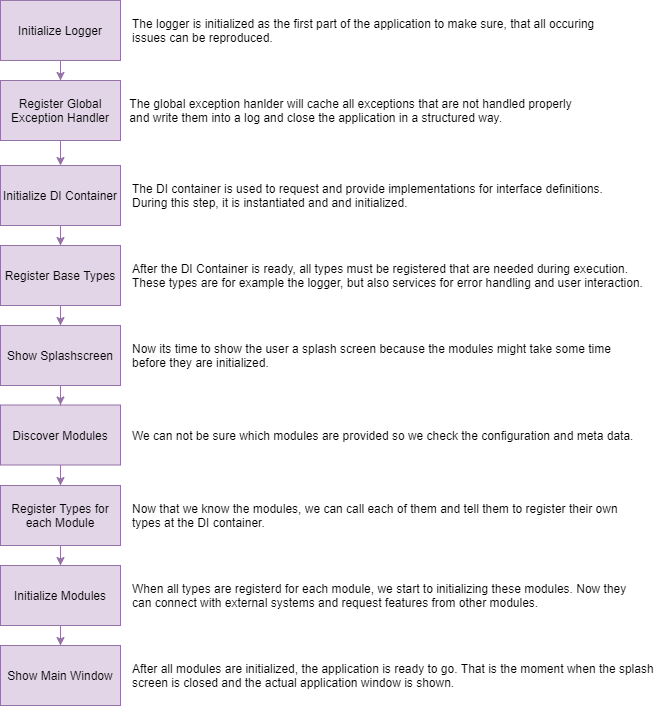

# Table of Contents

- [Table of Contents](#table-of-contents)
- [Introduction and Goals](#introduction-and-goals)
- [Architecture Constraints](#architecture-constraints)
  - [Organizational Information](#organizational-information)
  - [Technical Constraints](#technical-constraints)
  - [Conventions](#conventions)
- [System Scope and Context](#system-scope-and-context)
  - [Business Context](#business-context)
  - [Technical Context](#technical-context)
    - [User Roles](#user-roles)
    - [Software Systems](#software-systems)
    - [Hardware Systems](#hardware-systems)
- [Solution Strategy](#solution-strategy)
  - [General Architecture](#general-architecture)
- [Building Block View](#building-block-view)
  - [Whitebox Overall System](#whitebox-overall-system)
    - [Motivation](#motivation)
    - [Domain Modules](#domain-modules)
    - [Service Modules](#service-modules)
- [Cross-cutting Concepts](#cross-cutting-concepts)
  - [Domain Model](#domain-model)
  - [Bootstrapping](#bootstrapping)
  - [Errors and User Interactions](#errors-and-user-interactions)
    - [Types of Errors](#types-of-errors)
    - [Types of User Interaction](#types-of-user-interaction)
    - [Interfaces for User Interaction](#interfaces-for-user-interaction)
  - [Navigation](#navigation)
  - [Logging](#logging)
    - [How, when and what to log?](#how-when-and-what-to-log)
      - [Log levels](#log-levels)
    - [What should not be logged?](#what-should-not-be-logged)
- [Design Decisions](#design-decisions)
  - [DI Container & Strategy Pattern](#di-container--strategy-pattern)
- [Risks and Technical Debts](#risks-and-technical-debts)
  - [Risks](#risks)
  - [Technical debts](#technical-debts)
- [Glossary](#glossary)
- [Acknowledgements](#acknowledgements)

# Introduction and Goals
This documentation describes all aspects that have to be taken into account during development and maintenance of software systems in the context of ???. The arc42 template is used as a basic structure. According to this, the documentation is divided into various chapters which start with an external view and go more and more into details. 

# Architecture Constraints

## Organizational Information

This chapter describes important orginazational topics.

| Name | Background |
| -- | -- |
| Source Code Repository | Link to the source code repository. |
| Documentation Repository | Link to the documentation repository. |
| Requirements documnetation | Link to the requirements backlog. |
| Architecture Documentation of early software versions | Link to other architecture documents.|

## Technical Constraints

This chapter describes the basic constrains that must be taken into account when working with the described software systems.

| Constraint | Description |
| -- | -- |
| Basic Architectual Character | |
| Operating on windows desktop systems | No support for Linux, Mac, Mobile or Web |
| Technological Basis | .NET 4.7.2, C#, WPF |

## Conventions

This chapter links to guidelines and conventions that must be followed during design and development of the software systems.

| Convention | Backgorund |
| --- | -- |
| [UML inspired diagrams](https://github.com/HerrLoesch/UMLite) | The UML is complex thus only a subset of its features is used. Diagrams or artifacts outside the UML should be avoided. |
| Coding Guidelines  |  |
| ... | |


# System Scope and Context

## Business Context


## Technical Context


### User Roles

| Name       | Description                                                  |
| ---------- | ------------------------------------------------------------ |
| ?   |? |


### Software Systems

| Name | Description |
| ----- | ----------|
| ? | ? |


### Hardware Systems

| Name | Description |
| ----- | ----------|
| ? | ? |


# Solution Strategy


## General Architecture


# Building Block View

This chapter describes the internal structure of the application. It builds on the descriptions from the [technical context](#technical-context) and refines them over several stages. However, only the most important components are described in more detail. 

## Whitebox Overall System

### Motivation


### Domain Modules


### Service Modules


# Cross-cutting Concepts

## Domain Model

Based on [Wikipedia](https://en.wikipedia.org/wiki/Domain_model): A domain model is a system of abstractions that describes selected aspects of a sphere of knowledge, influence or activity. The model can then be used to solve problems related to that domain. The domain model is a representation of meaningful real-world concepts pertinent to the domain that need to be modeled in software. The concepts include the data involved in the business and rules the business uses in relation to that data. A domain model leverages natural language of the domain.

The following domain model is intended to be simple and short in order to keep it easily up-to-date. It serves as a starting point for a much more detailed object model, which can be found in the source code and is maintained there.


The following important domain objects result from the domains under consideration:

| Name | Description |
| ------ | ----- |
| ? | ? |


## Bootstrapping

A bootstrapping is required for modules so they can be initialized correctly during the applications start. The Bootstrapper is a component that acquires all necessary resources for the application during startup. It connects the system to external systems, determines the existing modules and informs them when they should initialize themselves. The bootstrapper should have these steps: 



The bootstrapper is implemented in the application core and provided as a base class for all executables that use the core.

## Errors and User Interactions
### Types of Errors
Different types of errors can occur within software. Some of them are not actual errors but simply data or state changes the developers or user did not expect. We have to distinguish between the following types of "errors":

Not visible to the user:
- Can be resolved by the software itself
- Can not be resolved by the software
  

Visible to users:
- Can be resolved by the user
- Can not be resolved by the user  

If the software can not resolve an error it can ask the user for help. For example, if a file can not be opened because it does not exists, the software can recognize the missing file and prompt an error message to the user. Then the user is informed and might provide the file from another place than the one expected by the software. On the other hand it can also be possible, that the user decides that the file does not need to be available and thus the software should proceed without the file. In this case it is not an error but rather a different execution path within the software.

This means that errors are usually only real errors if the software cannot react to them. Whether the software can react depends to a large extent on what information the caller of an action receives from the executor of an action and what the developer expected to happen when he wrote the code.

### Types of User Interaction
Based on this information two different types of user interactions have to be taken into account:

- *Notifications* - Information to the user with no possibility to influence the executed logic. An example: "Configuration file corrupt, application will shut down!" The interface of a notification service is described in the common user interface foundation implementation.
- *Confirmations* - Information to the user that will force him at least to an acknowledgement but could also ask him for particular actions. An example: "Could not write file. Try again?" The interface of a confirmation service is described in the common user interface foundation implementation.

During startup a special case of user interaction can happen. At this point the software might not be fully initialized, user interaction is then limited. For this reason only a message can be prompted to the user and than the application has to be closed after the users acknowledgement. This acknowledgement is handled by the bootstrapping and not the modules or components where the error occured thus the bootstrapping also closes the application.

### Interfaces for User Interaction
Two interfaces are provided to interact with the user *INotificationService* and *IConfirmationService*. The *NotificationService* takes a message and serverity to show the user a message box. The confirmation service can also be modular and thus does not allow the usage of the application until the user acknowledges the dialog.


## Navigation

The following navigation service has following important parts:
1. A general interface for the navigation service registered as base type during bootstrapping. This interface can then be requested via dependency injection by the view models to trigger further navigation.
2. A [frame](https://docs.microsoft.com/en-us/dotnet/api/system.windows.controls.frame?view=windowsdesktop-6.0) based main window that is called shell.
3. The class that implements the navigation service interface, holds a reference on the shell as well as the references on the views. 
4. All vies or view models that can be targeted during navigation have to implement an interface and must be registered during the bootstrapping. 


## Logging
### How, when and what to log?
Logging should be done by a central service that is initialized and provided by the application core. It and can be requested by each an every component via dependency injection. It provides various functions to persist information about the status of the application and should be used when ever the information might help to resolve issues that occur during production.

The log should always be written by the part of the software where an issue occurred initially or where errors of other parts hinder the usual process. Exceptions should always be logged when they are cached. If an exception occurs as part of a methods result, it can, but does not need to be logged because it can be assumed that it was logged the first time it appeared.

#### Log levels

- Fatal: When a fatal log is created something is very wrong, it could be that the whole application is going down. This log level should be used when something has to be looked into as soon as possible.
- Error: The most common use of the error log level is an exception. Something has happened that should not have happened and you might need to take a look at it. It does not have to be an exception that causes an error log, it could also be a validation that fails or a path in the code that should not have been reached.
- Warning: Warnings are not necessarily errors, but tells us that something is off. An example would be if a call failed, therefore we will automatically try again in 10 seconds and we log that as a warning. It can be a gray area when to use warning and information.
Information: Information can be anything that is useful, everything from "This service has received/sent a message" or that a service is starting up.
- Debug: debug is used while debugging, often production code does not log this level and ignores everything logged below info.

Besides the log level and possible exception it must also be logged in which context the information occurred and when the log was written thus helping to trace the root of problems faster.

### What should not be logged?
Some developers try to include as many information as possible in a log, making it risky to store those logs, and extremely dangerous to submit them, especially when the customer doesn't know this information is stored. In particular, personal information about the user or  persons who are associated with the system in any way can lead to significant data protection violations if these information can be freely viewed in a log. In addition, logs may circumvent the obligation of confidentiality if references to or complete detailed information on intellectual property can be found in the log. For this reason, the following items should not been written of necessary be anonymized and only be written to a log in consultation with the relevant stakeholders.

- Passwords and access information on external systems.
- IP addresses and network information (MAC address, host name, etc.)
- Personal data of any kind.
- Direct user input form users.
- Specific algorithms or even source code (snippets).
- Sequence of method calls which, in combination, allow to determin algorithms that are worth protecting.

# Design Decisions

This chapter contains information about important design decisions like chosen frameworks.

## DI Container & Strategy Pattern
[AutoFac](https://autofac.readthedocs.io/en/latest/getting-started/index.html) is selected as DI Container because of its rich feature set and its [module handling concept](https://autofac.readthedocs.io/en/latest/configuration/modules.html). It is also a well structured and maintained framework with a large community. Furthmore it allows to use the [Strategy](https://en.wikipedia.org/wiki/Strategy_pattern) design pattern that is used for the scoring algorithms, hardware access and other parts of the application. Unfortunatly it is not highlighted in the documenation of AutoFac which why it is explained in this chapter.

AutFac separates the registration of types and their resolution into two steps. First all types are registered in a *ContainerBuilder*. Based on this builder the container is created with which the registered types can then be resolved. A type registration with AutoFac can look like this example:

```c#
IContainer RegisterTypes()
{
    var builder = new ContainerBuilder();
    builder.RegisterType<AlgorithmA>().As<IScoringAlgorithm>();
    builder.RegisterType<AlgorithmB>().As<IScoringAlgorithm>();

    builder.RegisterType<AnalysationViewModel>();

    return builder.Build();
}
```

In this case three type are registered:

- AlgorithmA as IScoringAlgorithm
- AlgorithmB as IScoringAlgorithm
- AnalysationViewModel without specific interface that allows to select one of the algorithms from a list to calculate a score for a given measurement.

```c#
    public interface IScoringAlgorithm
    {
        string Name { get; set; }

        Score Calculate(Measurement measurement);
    }
```

With Auto Fac, the ViewModel only needs to request the algorithms as a list of type *IScoringAlgorithm* in its constructor and can then provide them through a property to the view. This means, that the interfaces for the scoring algorithms define our strategy for such algorithms and which are aggregated by the ViewModel.

```C#
    public class AnalysationViewModel
    {
        private IEnumerable<IScoringAlgorithm> algorithms;

        public AnalysationViewModel(IEnumerable<IScoringAlgorithm> algorithms)
        {
            this.algorithms = algorithms;
        }
    }
```

# Risks and Technical Debts

## Risks

Risks describe things that can have a negative impact on the product or individual components. There should be an assessment of the severity of each risk and a definition of possible countermeasures.

| Name | Description | Severity | Counter Measures |
| -- | -- | -- | -- |
| .NET 4.7.2 | The applications are based on older .NET Versions. Microsoft switched to a completly new structure with .NET Core. .NET 5 and high has features that are not compatible with .NET 4.7.2.  | Medium | It is reccomended to migrate to a newer version as soon as posisble because the migration will become increasingly difficult with each new version of .NET. |
| MVVM Light Toolkit | The MVVM Light Toolkit is a frameworks that helps to develop WPF applications based on the [MVVM](https://en.wikipedia.org/wiki/Model%E2%80%93view%E2%80%93viewmodel) pattern. Since 2021 this framework is no longer maintained and thus will not receive further updates. | Medium | As long as the application is not migrated on .NET Versions > 4.x this should not cause any problems but during a migration the MVVM Toolkit should be replaced by [Microsofts MVVM Toolkit](https://docs.microsoft.com/en-us/windows/communitytoolkit/mvvm/introduction). |


## Technical debts
[Technical debts ](https://en.wikipedia.org/wiki/Technical_debt)  is the implied cost of additional rework caused by choosing a solution that is not appropricate for the actual issue to solve. This can happen due to many factors like time pressure, ignorance or missing knowledge. It is important to keep track of technical debts because it will highly influence common solutions and should be decreased regularly via refactorings.

| Name | Description | Counter Measures |
| ? | ? | ? |


# Glossary

| Term | Description |
| ---- | ---- |
| ? |	? |


# Acknowledgements

© We acknowledge that this document uses material from the arc 42
architecture template, <http://www.arc42.de>. Created by Dr. Peter
Hruschka & Dr. Gernot Starke.
